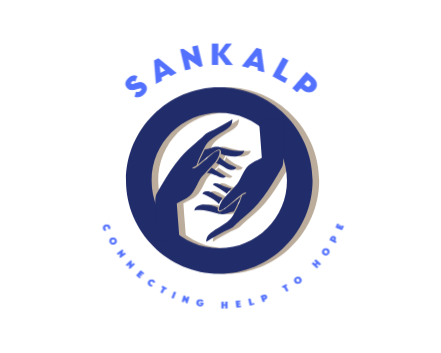

<div align="center">
  
  <h1>🤝 Sankalp: Connecting Help to Hope</h1>

  <p>
    <a href="#"></a>
    <a href="#"></a>
    <a href="#"></a>
    <a href="#"></a>
    <a href="#-license--copyright"></a>
  </p>
</div>

**Sankalp** is a centralized, high-availability disaster relief coordination platform designed to bridge the gap between active crisis zones and those eager to help. By eliminating fragmented communication, the platform seamlessly connects verified ground-level NGOs with corporate partners and institutions ready to conduct targeted relief drives.

---

## 🏛️ Executive Leadership

- **Founder & Executive Director:** **Mr. Manmath N. Sangave**
- **Platform Initiative:** **Sankalp Social Awareness Network**
- **Vision:** Eliminating administrative friction between corporate CSR resources, NITI Aayog Darpan-verified non-profits, and passionate citizen volunteers through immutable digital certification and real-time community mobilization.

---

## 🚀 Key Platform Capabilities

### 1. 🤝 Unified Tri-Party Operating Model
- **For Corporates & Companies:** Easily fulfill corporate CSR mandates, discover verified non-profit partners, submit drive requests with official sanction letters, and generate instant ESG impact reports.
- **For Non-Profit Partners (NGOs):** Use a unified management dashboard to organize awareness campaigns across government offices, colleges, and public institutions, while issuing verifiable digital credentials.
- **For Volunteers:** Discover nearby on-ground drives or short 2–5 hour micro-tasks (content, design, outreach, coding), track verified volunteer hours, and receive authentic certificates for resumes and LinkedIn.

### 2. 📜 Cryptographic Digital QR Certificate Studio
- Immutable SHA-256 digital signature hashes embedded in every issued certificate.
- Scannable dynamic QR codes for instant recruiter, HR, and institutional auditability.
- **1-Click LinkedIn Integration:** Direct dispatch schema pushing verified credentials to LinkedIn profiles.
- Integrated **Verify Credential Studio** inside the logged-in Volunteer Hub.

### 3. 🤖 AI-Assisted Corporate-NGO Matchmaker
The **AI Matchmaker** bridges the gap between corporate CSR funding and grassroots non-profits through an automated, intelligent compatibility algorithm:
- 🎯 **Cause & Focus Alignment:** Automatically pairs corporate social priorities (e.g., Digital Literacy, Healthcare, Disaster Relief, Women Empowerment) with specialized NGOs having proven track records in those domains.
- 📍 **Geographic & District Proximity:** Analyzes location coordinates to connect institutional branches with active on-ground NGOs in the same region, reducing logistical overhead.
- 👥 **Audience & Volunteer Capacity Matching:** Calibrates expected attendee turnout (100 to 1,000+ people) with the NGO's volunteer manpower to ensure smooth execution.
- 🛡️ **Automated Compliance Verification:** Pre-screens non-profits for active 80G tax-exempt status, 12A registration, and NITI Aayog Darpan credentials.
- 📊 **Instant Match Score & Proposal:** Delivers a transparent compatibility score (e.g., 96% Match) along with recommended campaign topics, enabling 1-click booking and coordination.

### 4. 🚨 SOS Rapid Disaster & Crisis Response
- Geo-radius (50km) emergency dispatch banner for immediate resource mobilization during floods, crises, and urgent relief operations.

### 5. 🔒 High-Contrast Adaptive Design System
- Modern glassmorphism UI with seamless **Dark Mode / Light Mode** switching.
- Strict high-contrast typography ensuring crystal-clear text readability on all registration and authentication forms.
- Passwordless 6-digit email OTP verification backed by Nodemailer & Express.

---

## 🛠️ Technology Stack

Sankalp leverages a modern, decoupled architecture designed for high availability during sudden traffic spikes.

| Layer | Technology | Primary Purpose |
| :--- | :--- | :--- |
| **Frontend Framework** | ⚛️ React 18 / Vite | Rapid HMR, optimized builds, and component state management. |
| **Styling & UI** | 🎨 Tailwind CSS | Utility-first responsive design and high-contrast accessibility. |
| **Routing** | 🧭 React Router v6 | Client-side SPA navigation and protected route boundaries. |
| **Database ORM** | 🗄️ Prisma | Type-safe database access and PostgreSQL schema management. |
| **Backend / API** | 🟢 Node.js / Express | RESTful endpoints, OTP dispatch, and webhook handling. |
| **Security & Auth** | 🔐 JWT / Crypto | Stateless RBAC authentication and pure SVG QR code generation. |
| **Deployment** | ☁️ Vercel / Netlify | Edge-network hosting for static assets and serverless functions. |

---

## 📂 Project Architecture

```plaintext
Sankalp/
├── public/                      # Static assets & routing redirects
│   ├── _redirects              # Netlify SPA fallback
│   ├── sankalp_logo.png        # Official platform logo
│   └── favicon.svg             # Application brand favicon
├── prisma/
│   └── schema.prisma           # Prisma ORM PostgreSQL schema
├── src/
│   ├── assets/
│   │   └── images/             # Photographic evidence & brand assets
│   ├── components/             # Reusable UI components & modals
│   │   ├── AuthModal.jsx       # Security gateway & OTP authentication
│   │   ├── CertificateStudio.jsx # Accredited PDF/Print certificate studio
│   │   ├── CorporateRequestModal.jsx # HR/CEO NOC sanction upload modal
│   │   ├── EventCard.jsx       # Interactive event drive card
│   │   ├── FirebasePhoneAuth.jsx # Firebase real-time Phone OTP component
│   │   ├── Navbar.jsx          # Compact horizontal navigation & theme toggle
│   │   ├── SosEmergencyBanner.jsx # SOS crisis dispatch alert
│   │   └── ToastNotification.jsx # Real-time reactive feedback toast
│   ├── context/
│   │   └── AppContext.jsx      # Global state, authentication, and DBMS store
│   ├── lib/
│   │   └── firebase.js         # Firebase Auth & invisible reCAPTCHA client
│   ├── utils/
│   │   └── qrCodeGenerator.js  # Pure SVG QR code generation engine
│   ├── views/                  # Primary full-page views
│   │   ├── AboutUsView.jsx     # Founder spotlight & Sankalp mission
│   │   ├── AdminDbmsView.jsx   # NGO administration, session audit & NOC inspector
│   │   ├── AiMatchmakerView.jsx # AI-powered CSR matchmaker wizard
│   │   ├── CertificateVerificationView.jsx # Public QR audit page
│   │   ├── CompanyLoginView.jsx # Corporate / Institutional portal
│   │   ├── CorporatePartnerView.jsx # Multi-NGO directory & ESG reports
│   │   ├── EsgReportGeneratorView.jsx # MCA Section 135 compliance export
│   │   ├── EventsView.jsx      # Skill-based & micro-volunteering hub
│   │   ├── HomeView.jsx        # Landing hero, impact statistics & triage
│   │   ├── NgoLoginView.jsx    # Partner access & Darpan onboarding
│   │   ├── PastHistoryView.jsx # Documented photographic audit archive
│   │   └── VolunteerDashboardView.jsx # Volunteer Hub & Verify Credential Studio
│   ├── App.jsx                 # View router, compact footer & modals
│   ├── index.css               # Global base tokens & high-contrast input layer
│   └── main.jsx                # React DOM entry point
├── api/                        # Vercel Serverless Functions
│   ├── send-email.js           # Serverless email dispatch
│   ├── send-otp.js             # Serverless OTP verification engine
│   └── send-sos.js             # Emergency SOS alert dispatcher
├── server.js                   # Node.js backend for Email OTP dispatch
├── vercel.json                 # Vercel deployment SPA rewrite configuration
└── package.json                # Project dependencies and build scripts
```

---

## 📜 Compliance & Accreditations
- **MCA Section 135**: Compliant corporate CSR documentation and audit trails.
- **NITI Aayog Darpan**: NGO accreditation ledger integration.
- **Tax Exemptions**: Form 80G & 12A compliant reporting workflows.

---

## 👨‍💻 Maintainer & Founder

**Mr. Manmath N. Sangave**  
*Founder & Executive Director, Sankalp Social Awareness Network*

> *"Technology is only as powerful as the impact it creates on the ground."*

Dedicated to leveraging software engineering for scalable humanitarian impact. Sankalp was conceptualized and engineered out of the necessity to eliminate logistical bottlenecks and establish transparent, verifiable coordination during critical disaster response windows.

- **Role:** Full-Stack Development, AI Integration & System Architecture.
- **Focus:** Engineering high-availability systems for social good, corporate ESG compliance, and secure data verification.
- **Repository:** [https://github.com/manmath2005/Sankalp-](https://github.com/manmath2005/Sankalp-)

---

## 📄 License & Copyright

**Copyright © 2026 Sankalp. All Rights Reserved.**

### Proprietary Software Notice
This project, including its architectural design, AI matchmaking algorithmic logic, Cryptographic QR Studio implementation, and complete source code, is strictly proprietary.

### Restrictions:
- **No Unauthorized Use:** You may not copy, modify, distribute, sell, or lease any part of this software or its included documentation via any medium without express written permission from the founder.
- **No Derivative Works:** The creation of derivative platforms, reverse engineering, or extraction of the matching logic is strictly prohibited.
- **Intellectual Property:** All UI components, workflows, and database schemas remain the intellectual property of Sankalp and Manmath N. Sangave.

> For partnership inquiries, licensing requests, or corporate CSR onboarding, please contact the maintainer directly.
